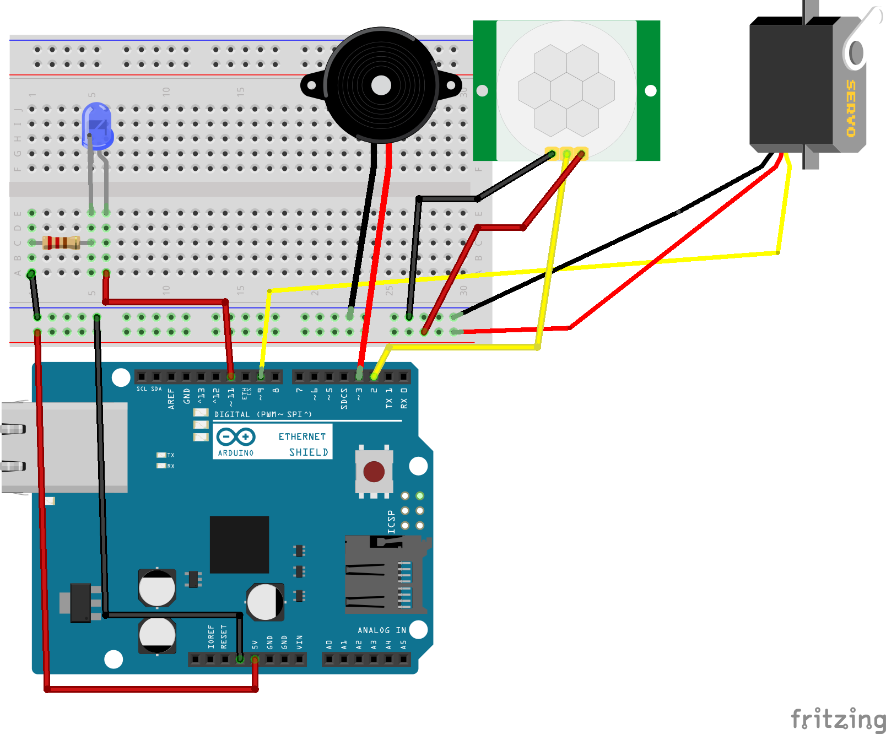
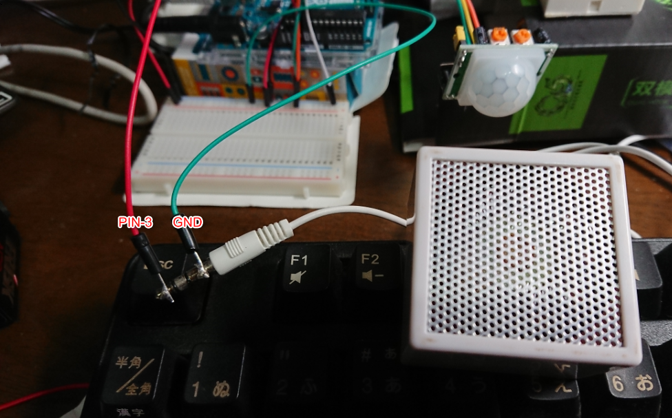
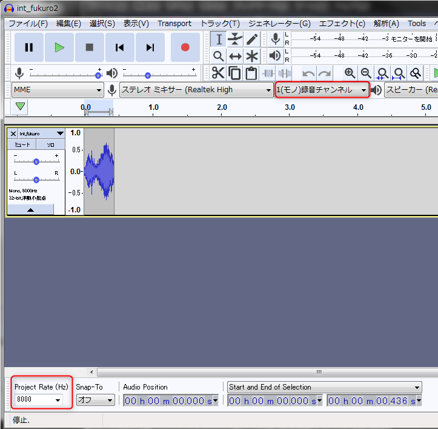
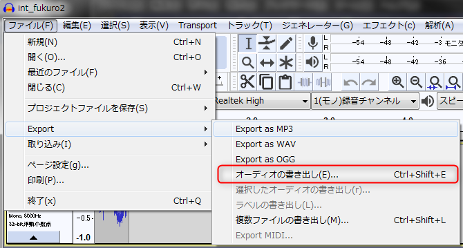
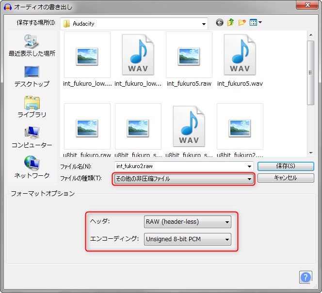

# Arduino Uno + センサー工作
娘が動くフクロウを作りたいというので、Arduinoでそれっぽいものを工作してみた。

## 動作
1. 人感センサーで動きがあると、スイッチON
2. LEDが徐々に明るくする
    * フクロウの目を想定
3. サーボモータを左右90度に回転
    * フクロウの首を回すつもり(現状クマさんが回る)
4. 元の位置に戻ったら、フクロウの鳴き声を出す
5. LEDを徐々に暗くする

## 部材
* Arduino UNO R3
* LED (抵抗 220kΩ)
* 人感センサー（HC-SR501)
* サーボモータ (Tower Pro マイクロサーボ SG92R)
* スピーカー (ノーブランドアクティブスピーカー)

## 回路図


## ポイント
1. アクティブスピーカー接続
    * 通常のジャック付のスピーカーなので、こんな感じに接続【電圧スピーカーだと、Toneしか鳴らせない）
    
    * Arduino側はPWMピン(-が付いているピン)を利用
2. 音声出力
    * 音声の編集はフリーソフト（Audacity)を利用
    * Arduinoでの音声出力はバイトコードにして埋め込まないと駄目

[手順]
* 音声を読み込んで、モノラル、8,000Hzに設定
 
* 音声を編集したらExport

* その他の圧縮ファイル/RAW/Ungigned 8-bit PCMで保存

* 文字コードに変換してArduinoのコードに埋め込む
```
$ xxd -i voice_file.raw
unsigned char voice_file[] = {
  0x7f, 0x84, 0x83, 0x80, 0x81, 0x7f, 0x7f, 0x7c, 0x81, 0x82, 0x81, 0x84,
  0x82, 0x83, 0x84, 0x85, 0x84, 0x83, 0x83, 0x82, 0x84, 0x80, 0x77, 0x78,
 ‥
   0x8c, 0x93, 0x95, 0x95, 0x93, 0x8f, 0x88, 0x7f, 0x77, 0x77, 0x78, 0x79,
  0x75, 0x72, 0x78, 0x7b, 0x79, 0x7a, 0x7d, 0x7d
};
unsigned int int_fukuro5_raw_len = 3488;
```
※　この時、そのまま貼ると、Arduinoのメモリが小さくエラーになる可能性が高いので``PROGMEM``キーワドを付けて、比較的容量の大きいFlashメモリから読み込むように設定する
```
const unsigned char voice_file[] PROGMEM = {
```
音声データは外出しで、OwlTone.h/OwlTone2.h/OwlTone3.h/OwlTone5.hの4種類あり、どれかを本体から呼び出すようにしている
> 現在はOwlTone5.hを利用しているが、スピーカーが性能が今一で、どれもフクロウっぽくない。。
